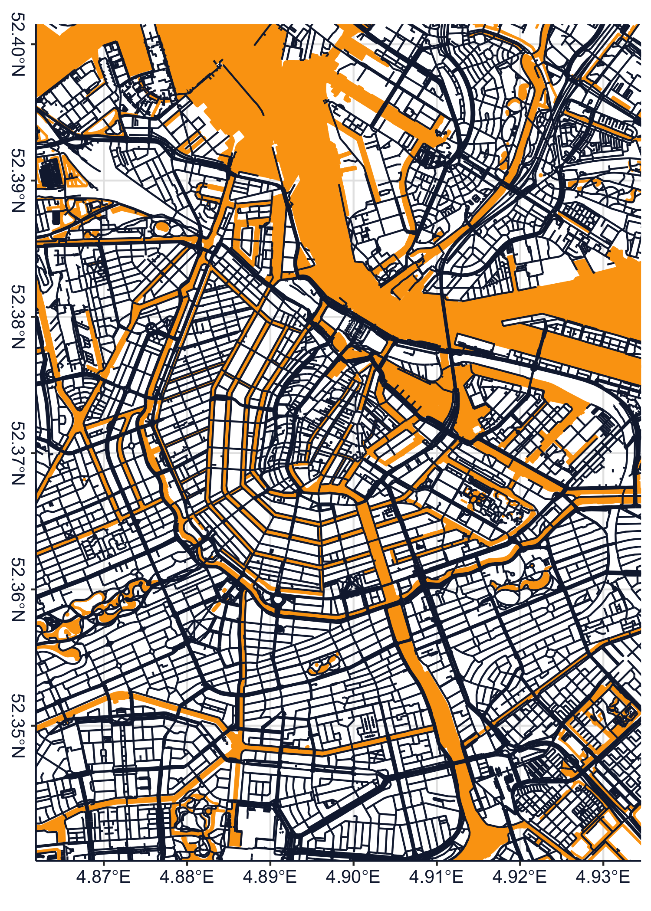

# 🗺️ rmaps: Minimal maps generated with R


Collection of R functions to render minimal maps using `ggplot`.

# Getting Started

This project is intentionally not a R package and thus cannot be
installed. To use this project, clone the repository and run
`renv::install()` to install necessary packages / dependencies (if you
do not have `rev` installed yet, you might have to run
`install.packages("renv")` first and restart your R session). To quickly
render a map, simply run the following snippet of code with the working
directory set to this repository.

``` r
# This will load all included functions & packages
source("load.R")

# Download mapdata
if (!file.exists(get_cache_path("amsterdam_example", type = "boundingbox"))) {
  # Example bounding box of central Amsterdam
  boundingbox <- st_bbox(c(xmin = 4.861836, ymin = 52.340088, xmax = 4.934535, ymax = 52.401469))
  
  # This will download the data and automatically write it into a cache file
  # so as to not overload the free OpenStreetMaps API
  download_mapdata(data_id = "amsterdam_example", boundingbox = boundingbox)
}

# Load the data from cache
mapdata <- load_mapdata("amsterdam_example")

# Render the final map (this function has options for recoloring etc.)
render_map(mapdata)
```

<!-- -->
